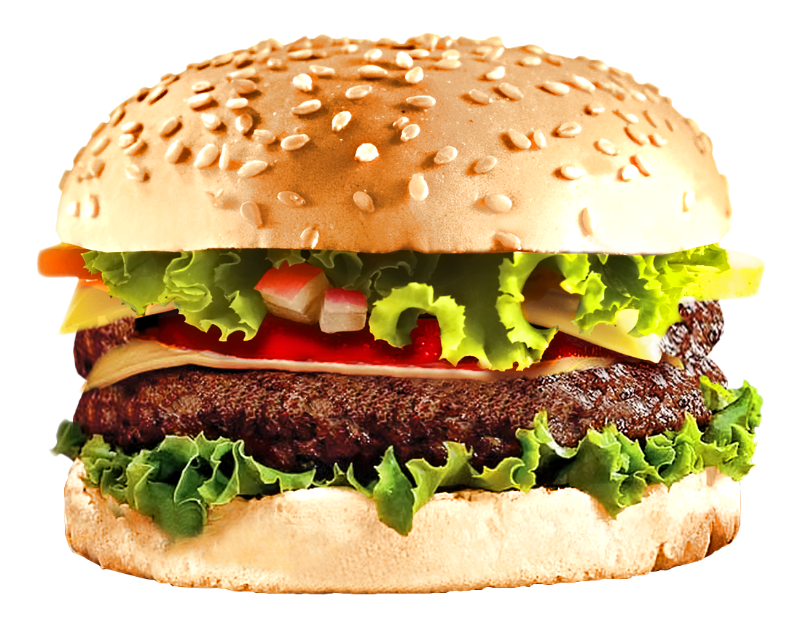
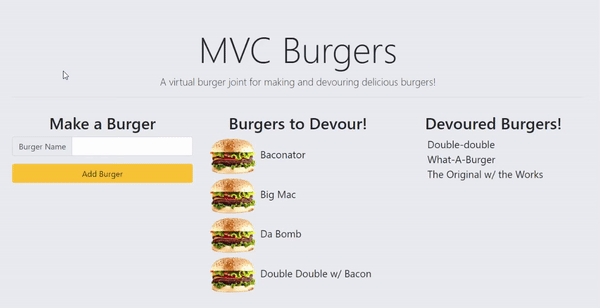

<p>

</p>

# MVC Burgers


## Description
MVC Burgers is a virtual burger restaurant that allows users to make and devour burgers. This application demonstrates the MVC design pattern. It uses Node and MySQL to query and route data, and Handlebars to generate HTML.

## Table of Contents
* [Links](#links)
* [Animation](#animation) 
* [Instructions](#instructions) 
* [Installation](#installations) 
* [Tests](#tests)   
* [License](#license)
* [Contact](#contact)

## Links
Published URL: [https://mvc-burgers.herokuapp.com/](https://mvc-burgers.herokuapp.com/)

Repository: [https://github.com/spencercreer/burger](https://github.com/spencercreer/burger)


## Animation
The following animation demonstrates the application functionality:


## Instructions
Make a burger by entering a name in the "Burger Name" field. Your burger will be added to the SQL database and will appear in the "Burgers to Devour" section. Devour burgers by clicking the burger picture.

## Installation
This application utilizes the following dependencies:

 * express
 * express-handlebars
 * dotenv
 * mysql

To install necessary dependencies, run the following command:

  ```
  npm install
  ```

## Tests
Tests are written using Frisby and Jest. To run tests, start the server and run the following command:

  ```
  npm test
  ```
    
## Contribute
Please submit a PR if you would like to contribute.

## Technologies
 * JavaScript
 * Node.js
 * npm
 * Express.js
 * MySQL
 * Heroku
 * Handlebars

## License
This project is licensed under the MIT license.

## Contact
For questions or comments, please contact me.

Email: <a href="mailto: spencercreer@gmail.com" target="_blank">spencercreer@gmail.com</a>

GitHub: [spencercreer](https://github.com/spencercreer/)
